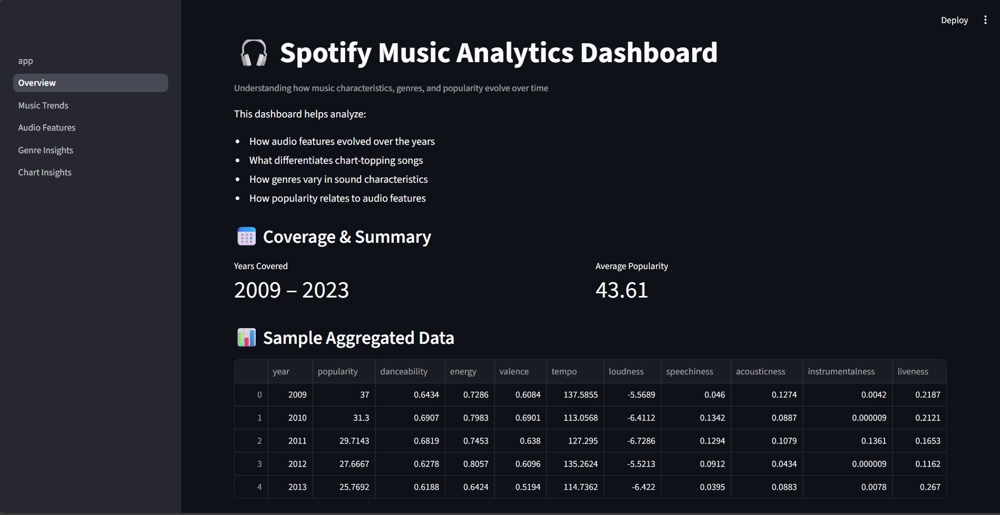
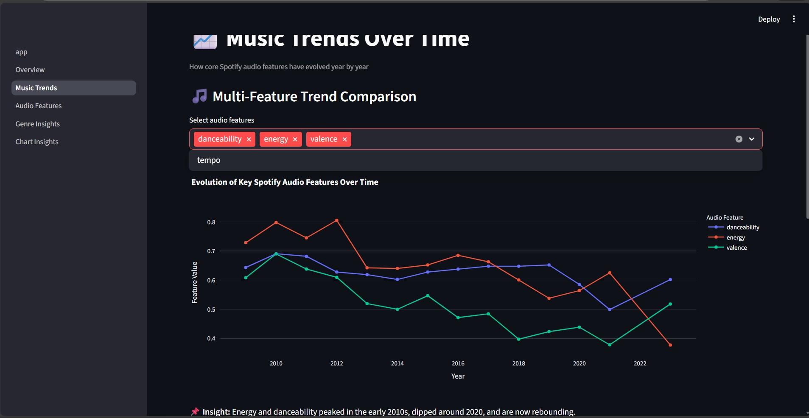
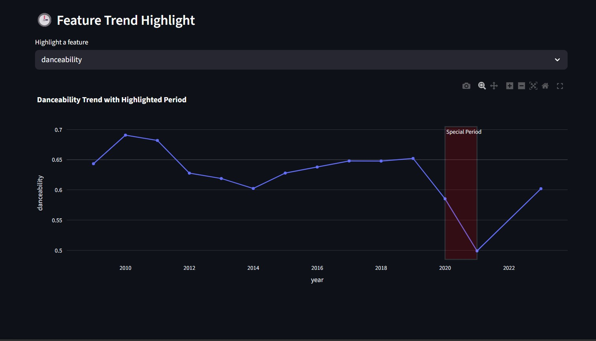
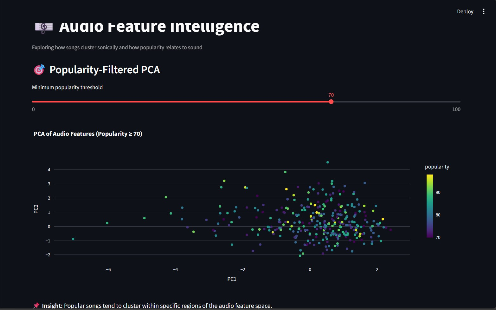
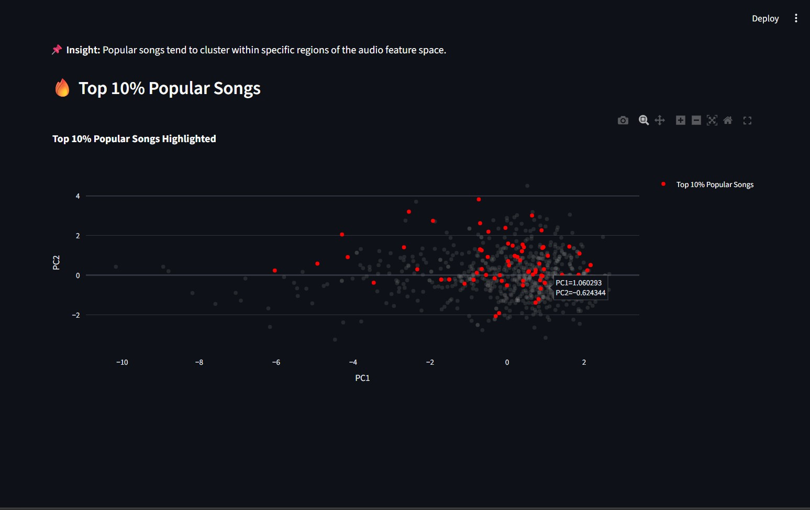
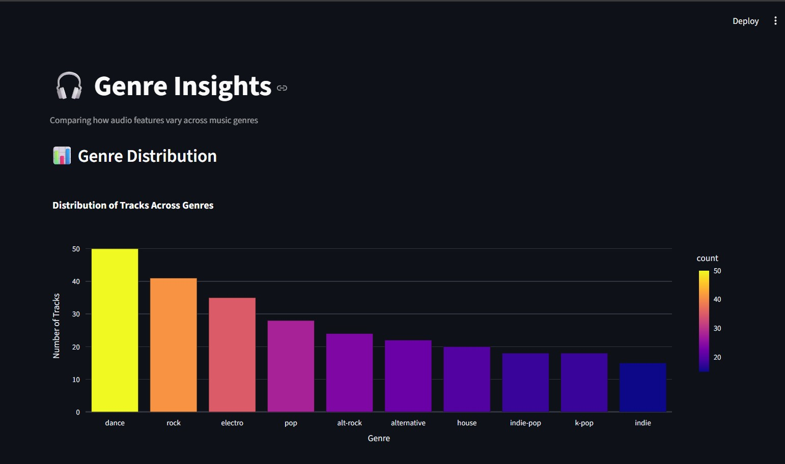
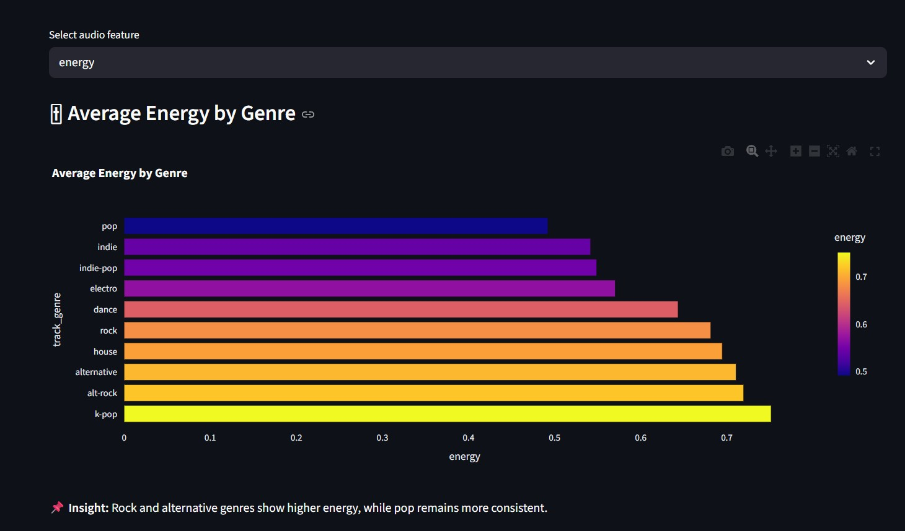
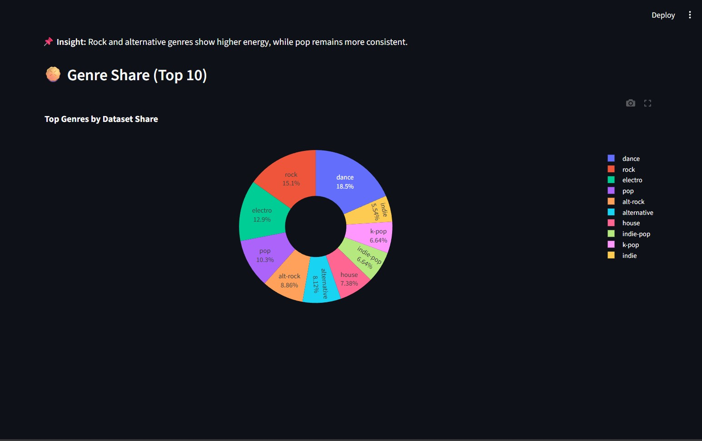
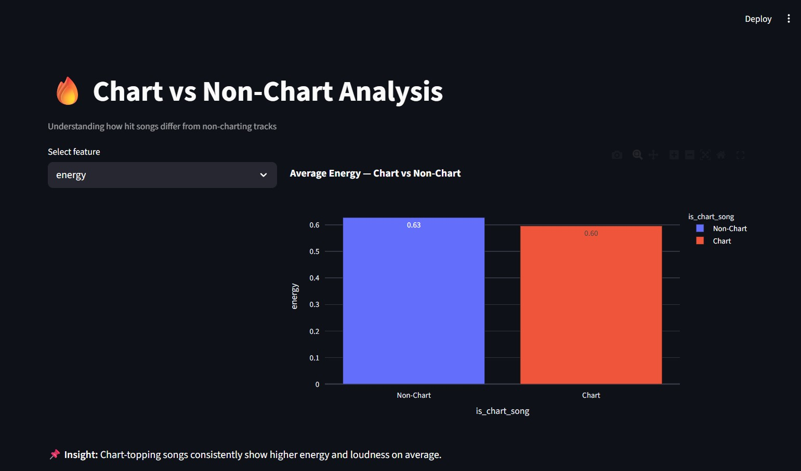
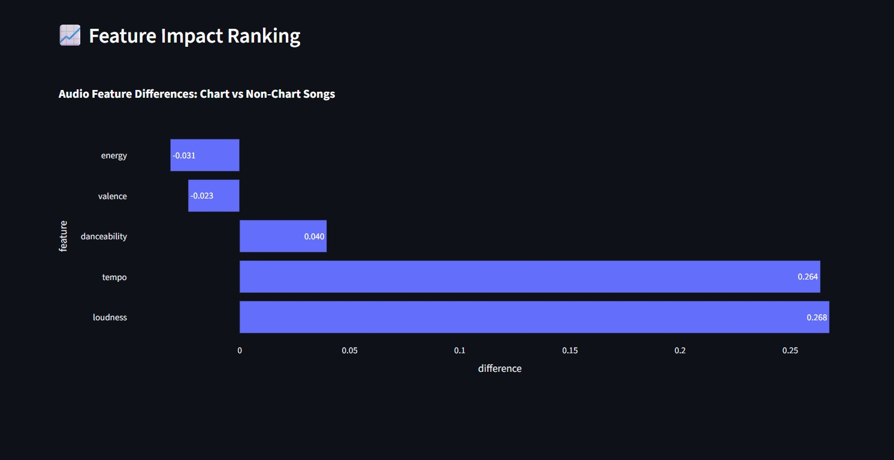

.
---

# 🎧 Spotify Music Analytics Dashboard

An interactive, data-driven dashboard built using **Streamlit**, **Plotly**, and **Pandas** to analyze global Spotify music trends, audio features, genre characteristics, and chart performance.

This project focuses on **exploratory data analysis and visualization**, presenting insights through clean, interactive dashboards rather than predictive modeling.

<p align="center">
  
</p>


---

## 📌 Project Overview

This project analyzes Spotify music data spanning **2009 to 2023** to understand:

* How music audio characteristics have evolved over time
* What differentiates **chart-topping songs** from non-charting tracks
* How **genres differ** in terms of audio features
* How **popularity relates to sound patterns** in music

The goal is to combine **structured data processing**, **visual analytics**, and **interactive storytelling** into a single, portfolio-grade analytics application.

---

## 📊 Datasets Used

All datasets were sourced from **Kaggle** and processed locally.

The project uses only the following datasets and attributes:

* **Spotify Global Music Dataset (2009–2025)**

  * Track metadata
  * Popularity scores
  * Release year information

* **Spotify Audio Features Dataset**

  * Danceability
  * Energy
  * Valence
  * Tempo
  * Loudness
  * Acousticness
  * Speechiness
  * Instrumentalness
  * Liveness

* **Spotify Top Charts Dataset**

  * Used to label songs as **Chart** vs **Non-Chart**
  * Binary indicator: `is_chart_song`

* **Genre-Enriched Spotify Tracks Dataset**

  * Track-level genre labels (`track_genre`)
  * Enables genre-wise comparison and aggregation

No external APIs or live data sources were used.

---

## 🧠 Analytics & Techniques Applied

This project focuses on **descriptive and exploratory analytics**, using the following techniques:

### 📈 Trend Analysis

* Year-wise aggregation of audio features
* Analysis of long-term changes in music characteristics

### 🎼 Audio Feature Intelligence

* Dimensionality reduction using **Principal Component Analysis (PCA)**
* Visualization of songs in reduced audio feature space
* Popularity-based filtering and highlighting

### 🎧 Genre-Level Analysis

* Genre distribution analysis
* Comparison of average and distributional audio features across genres

### 🔥 Chart vs Non-Chart Analysis

* Binary classification of songs as charting or non-charting
* Feature-wise comparison to identify differences

No predictive modeling or deep learning was applied — the emphasis is on **insightful visualization and interpretation**.

---

## 📊 Dashboard Sections & Visualizations

The Streamlit application is divided into the following sections:

---

### 🧭 Overview

**Purpose:** High-level summary of the dataset and project scope

**Visuals & Elements:**

* Dataset coverage (years)
* Average popularity metric
* Preview of aggregated yearly data

---

### 📈 Music Trends Over Time

**Purpose:** Analyze how music characteristics evolve year by year

**Charts Used:**

* Multi-feature **line chart** (danceability, energy, valence, tempo)
* Single-feature **highlighted trend chart** with special period emphasis

**Analytics:**

* Temporal trend analysis
* Feature comparison across years

---

### 🎼 Audio Feature Intelligence

**Purpose:** Explore how songs cluster based on audio characteristics

**Charts Used:**

* **PCA scatter plot** colored by popularity
* Popularity-threshold filtered PCA view
* Highlighting of **top 10% most popular songs**

**Analytics:**

* Dimensionality reduction (PCA)
* Popularity-driven clustering behavior

---

### 🎧 Genre Insights

**Purpose:** Compare audio features across different music genres

**Charts Used:**

* **Bar chart** for genre distribution
* **Horizontal bar chart** for average feature by genre
* **Box plot** for feature distribution across genres
* **Pie chart** for top genre share

**Analytics:**

* Genre-wise aggregation
* Distribution and variability analysis

---

### 🔥 Chart vs Non-Chart Analysis

**Purpose:** Identify what differentiates hit songs from others

**Charts Used:**

* **Grouped bar chart** (average feature comparison)
* **Horizontal bar chart** showing feature impact differences
* **Box plot** for distribution comparison

**Analytics:**

* Binary comparison (Chart vs Non-Chart)
* Feature gap analysis

---

## 📸 Dashboard Screenshots

> Below are selected screenshots highlighting key analytics and visualizations from the Spotify Music Analytics Dashboard.

### 🧭 Overview

High-level summary of dataset coverage, average popularity, and yearly aggregated audio features.





---

### 📈 Music Trends Over Time

Visualizes how core audio features such as danceability and energy evolve across years.





---

### 🎼 Audio Feature Intelligence

PCA-based visualization showing how songs cluster in audio feature space, colored by popularity.







---

### 🎧 Genre Insights

Genre-wise comparison of audio features using bar charts, box plots, and pie charts.









---

### 🔥 Chart vs Non-Chart Analysis

Comparison between chart-topping and non-charting songs across multiple audio features.





---

## 📝 Note on Screenshots

* Screenshots were captured directly from the Streamlit application
* Images are stored inside a `/screenshots` directory in the repository
* Each image corresponds to a specific dashboard section

---


## 🛠️ Tech Stack

### Programming & Analysis

* Python
* Pandas
* NumPy

### Visualization

* Plotly
* Plotly Express

### Application Framework

* Streamlit

### Environment

* Python virtual environment
* Local CSV-based data pipeline

---

## 🧱 Project Structure

```
spotify-project/
│
├── data/
│   ├── raw/
│   └── processed/
│       └── analytics_ready/
│
├── notebooks/
│   ├── 01_data_exploration.ipynb
│   ├── 02_cleaning_and_processing.ipynb
│   ├── 03_trends_analysis.ipynb
│   ├── 04_audio_features.ipynb
│   ├── 05_genre_and_chart_analysis.ipynb
│   └── 06_visualization_upgrade_lab.ipynb
│
├── streamlit_app/
│   ├── app.py
│   ├── utils.py
│   └── pages/
│       ├── 1_Overview.py
│       ├── 2_Music_Trends.py
│       ├── 3_Audio_Features.py
│       ├── 4_Genre_Insights.py
│       └── 5_Chart_Insights.py
│
└── README.md
```

---

## 🎯 Key Takeaways

* Popular songs tend to exhibit **higher energy and loudness**
* Genre characteristics strongly influence audio feature distributions
* Music trends show noticeable shifts around major global periods
* Popular tracks cluster within specific regions of audio feature space

---

## 🚀 How to Run the Project

```bash
pip install -r requirements.txt
streamlit run streamlit_app/app.py
```

---

## 📌 Note

This project is designed as a **portfolio-focused analytics application**, emphasizing:

* Clean architecture
* Reproducible analysis
* Insightful visualization
* Professional UI/UX

---

